# Mi Primera Aplicación en Flutter - Perfil Personal

# Objetivo
Desarrollar una aplicación básica en Flutter que demuestre la creación de un proyecto, el uso de widgets iniciales, ejecución en emulador, instalación de un paquete externo y publicación en GitHub.

## Descripción
Aplicación sencilla que muestra un perfil personal con información del usuario, diseñada con widgets como `Column`, `Row`, `Container` y `Card`. Incluye un botón interactivo que muestra/oculta información extra y lanza un mensaje emergente (SnackBar).

## Requisitos técnicos cumplidos
- [x] MaterialApp, Scaffold y AppBar con título.
- [x] Uso de Column, Row, Container y Card.
- [x] Colores personalizados (tema Indigo).
- [x] Botón con acción (cambia estado y muestra SnackBar).
- [x] Paquete externo instalado: **google_fonts** (estilo Poppins).

## Evidencias de instalación y ejecución

### 1. Comando flutter doctor
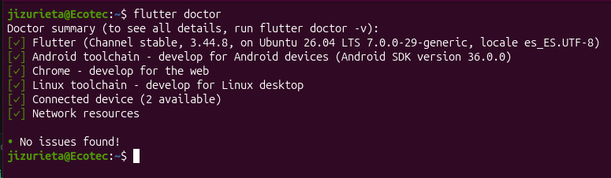

### 2. Proyecto en Visual Studio Code
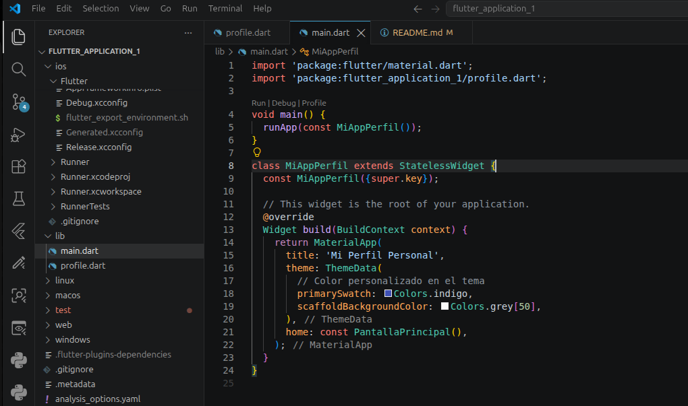

### 3. Emulador Android funcionando
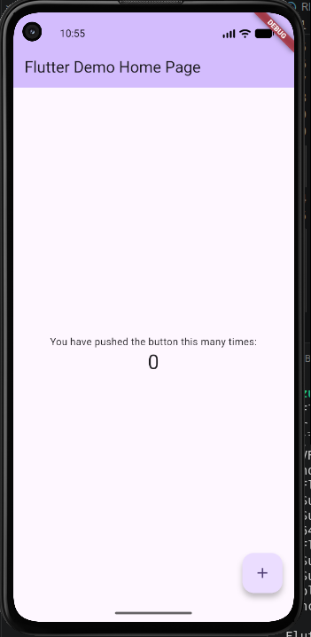

### 4. Aplicación ejecutándose
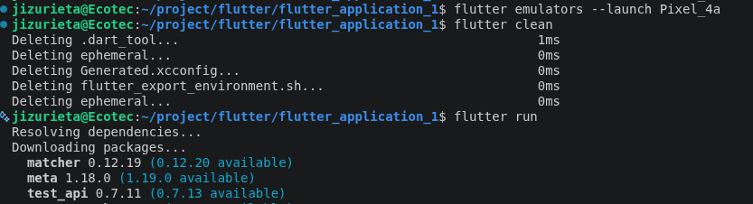

### 5. Instalación del paquete (pub get)
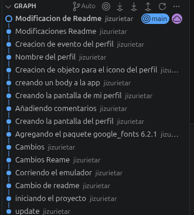

### 6. Pubspec.yaml con el paquete agregado
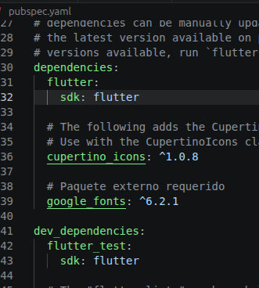

### 7. Repositorio en GitHub
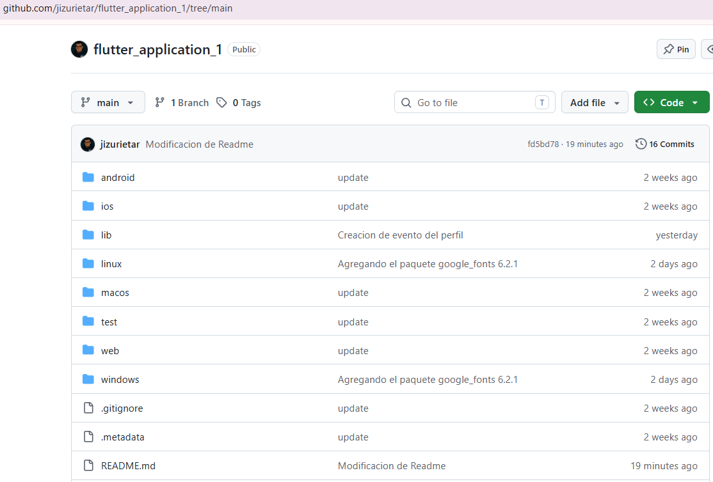

## Capturas de la aplicación

### Pantalla principal (estado inicial)
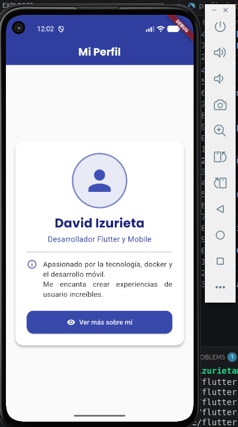

### Funcionamiento del botón (mostrando información extra)
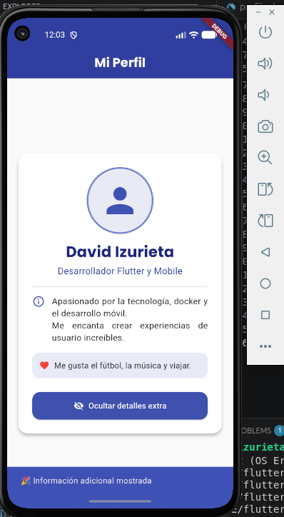

### Uso del paquete google_fonts (fuente Poppins)
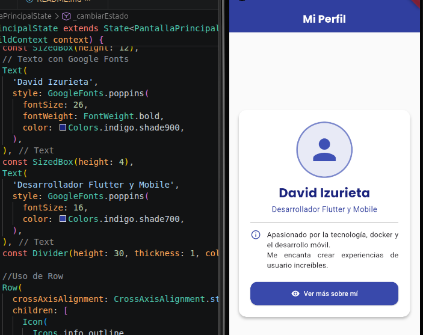

## Paseo por la creacion de la aplicacion

### Pantalla de mi perfil
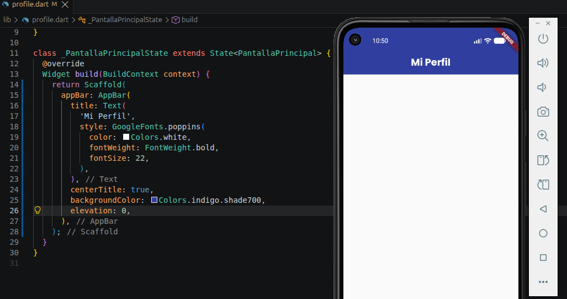

### Body de la app

### Icono del perfil
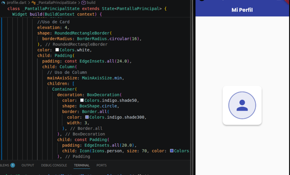

### Nombre del perfil y actividad
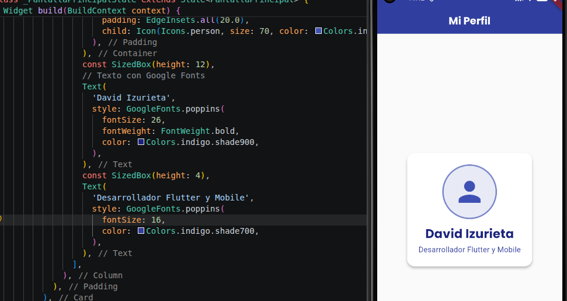

### Usando Row
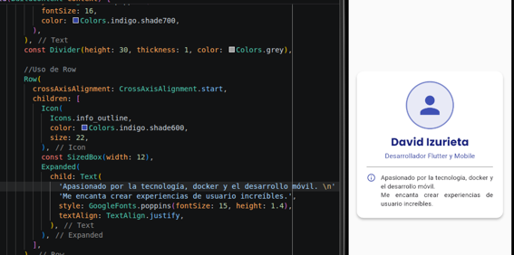

### Creacion del botón de eventos
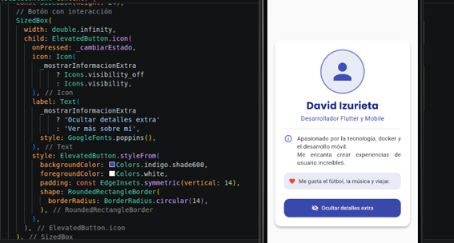

### Nueva Imagen
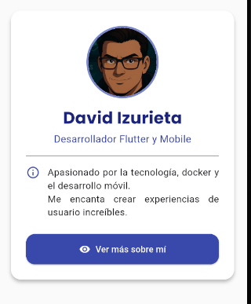

## Autor
**JAIME DAVID IZURIETA ROSERO**